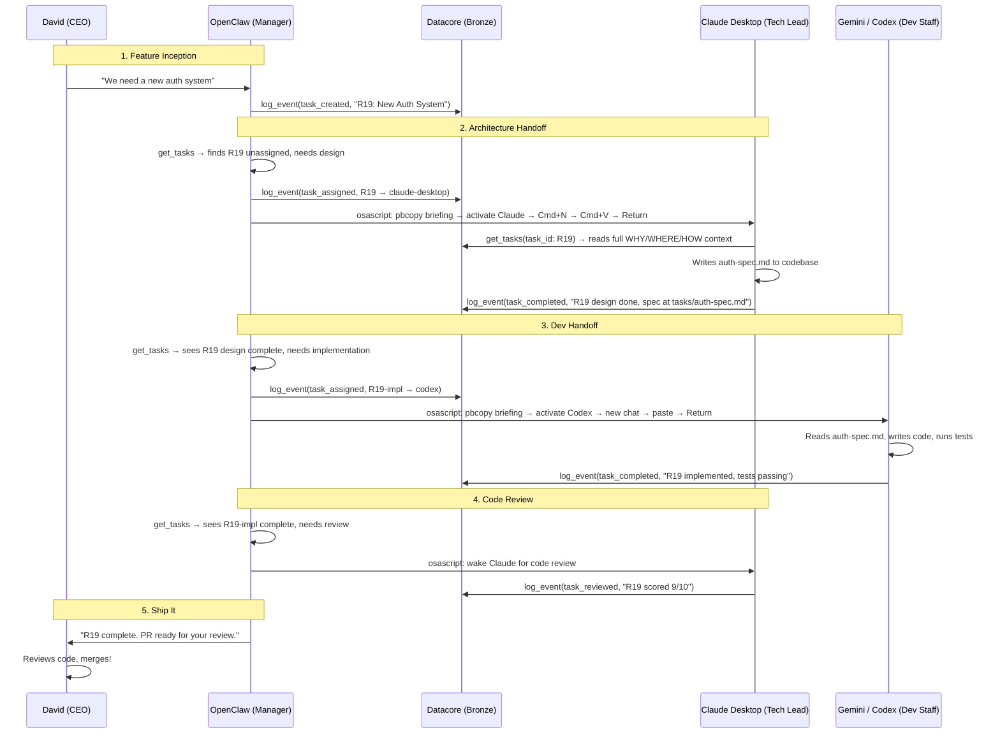

# Datacore AI Organization Chart

> Updated: March 22, 2026
> Version: v2 — reflects shell-based RPA wakeup, all-GUI team, and autonomous dispatch workflow

This document defines the roles, responsibilities, and interaction patterns for the autonomous multi-agent software development team powered by the Datacore Bronze/Silver memory layers.

---

## Communication Hierarchy

```
David (CEO) ──talks to──> OpenClaw (Manager)
                              │
                    ┌─────────┼─────────┐
                    ▼         ▼         ▼
              Claude Desktop  Codex    Gemini/Antigravity
              (Tech Lead)    (Builder) (Builder)
```

**Rule:** David only talks to OpenClaw. OpenClaw dispatches to everyone else. All coordination flows through Datacore events — no direct AI-to-AI communication outside the event bus.

---

## The Role Matrix

| **Title** | **Entity** | **App** | **Interface** | **Core Responsibilities** | **Datacore Interaction** |
| :--- | :--- | :--- | :--- | :--- | :--- |
| **CEO / Product Owner** | David | — | Talks to OpenClaw | Sets vision, creates tickets, final PR review | **Writes:** `task_created` via OpenClaw. **Reads:** `task_completed` for review. |
| **Project Manager** | OpenClaw | OpenClaw gateway | Headless (terminal) | 24/7 background loop. Polls Datacore, templates briefings, wakes GUI apps via shell `osascript`, tracks status. | **Reads:** `get_tasks` to find work. **Writes:** `task_assigned`, heartbeat events. |
| **Tech Lead / Architect** | Claude | Claude Desktop (`"Claude"`) | Native macOS GUI | Architecture, system design, code review, writes specs, scores work. | **Reads:** `get_tasks` + `search` for context. **Writes:** Specs to codebase, `task_completed` + `task_reviewed`. |
| **Dev Staff — Builder** | Codex | Codex.app (`"Codex"`) | Native macOS GUI | Code execution, builds features from specs, runs tests. GPT-5.4. | **Reads:** `get_tasks` for assignments. **Writes:** Code to repo, `task_completed`. |
| **Dev Staff — Builder** | Gemini | Antigravity (`"Antigravity"`) | Native macOS GUI (VS Code-style IDE) | Code execution, builds features from specs. Gemini 3.1 Pro. | **Reads:** `get_tasks` for assignments. **Writes:** Code to repo, `task_completed`. |

---

## The Wakeup Mechanism (R18)

All team members except OpenClaw are **native macOS GUI apps**. They cannot self-poll. OpenClaw wakes them using standard shell commands — no plugins, no MCP, no custom infrastructure.

### How It Works

1. **OpenClaw decides** a GUI app needs a task (via `get_tasks` polling)
2. **Guard clause:** Check if target app is already working (`get_tasks(assigned_to: X, status: "in_progress")`)
3. **Template briefing:** Compose a contextual message with task ID, title, and instructions
4. **Shell execution:** `pbcopy` the briefing + `osascript` to activate app, new chat, paste, send

### The Shell Payload (generic for all apps)

```bash
# 1. Load briefing into clipboard
echo "${BRIEFING}" | pbcopy

# 2. Wake the target app
osascript <<EOF
  tell application "${APP_NAME}" to activate
  delay 1
  tell application "System Events"
      ${NEW_CHAT_SHORTCUT}
  end tell
  delay 1
  tell application "System Events"
      keystroke "v" using command down
      delay 0.3
      key code 36
  end tell
EOF
```

### App Routing Map

```javascript
const teamApps = {
  "claude-desktop": { appName: "Claude",       newChat: 'keystroke "n" using command down' },
  "openai-codex":   { appName: "Codex",        newChat: 'type "/clear" + Enter, then paste' },
  "gemini-ide":     { appName: "Antigravity",   newChat: 'keystroke "l" using command down' }
}
```

> **Prerequisite:** osascript needs Accessibility permission in System Settings → Privacy & Security → Accessibility. Both `node` and `Terminal.app` are already granted. All three wakeup sequences tested and confirmed working (March 22, 2026).

### Key Design Decisions

- **Clipboard paste (Cmd+V) over keystroke injection** — atomic, no character-by-character fragility
- **New conversation before every nudge** — guarantees clean context, solves token limit accumulation
- **No screen reading** — all feedback flows through Datacore events, not DOM scraping
- **No MCP required** — `osascript` is a standard macOS command, runs via Node.js `execSync`
- **No plugin required** — the dispatcher is just OpenClaw logic + shell commands

### Rate Limit Awareness

OpenClaw checks for `rate_limit` events before dispatching to any AI. If a target AI is rate-limited, OpenClaw routes to an available alternative or queues the task. Every AI is instructed to log rate limit events when they encounter them. OpenClaw also logs rate limits reported by David. This prevents wasted dispatch cycles on unavailable AIs.

---

## The End-to-End Workflow

The following sequence diagram illustrates the lifecycle of a single feature request (e.g., Task R19) flowing through the entire corporate hierarchy using Datacore as the single source of truth.



**Key Takeaway:** David only talks to OpenClaw. OpenClaw dispatches everything. All coordination flows asynchronously through Datacore events. The `osascript` wakeup is a thin shell command — the intelligence lives in OpenClaw's dispatch logic and the three-layer task context (WHY/WHERE/HOW) in Bronze.
